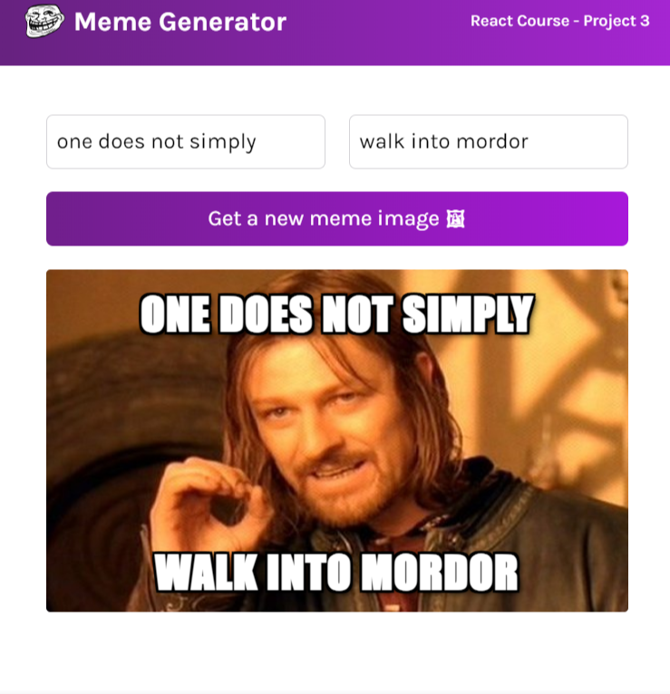

#  Meme Generator webapp 

## Table of contents

- [Overview](#overview)
  - [Requirements](#requirements)
  - [Figma-ui-design](#Figma-ui-design)
  - [Links](#links)
  - [Getting Started with Vite](#getting-started-with-Vite)
- [My process](#my-process)
  - [Built with](#built-with)
  - [What I learned](#what-i-learned)

## Overview

### The challenge

- Write top and bottom texts on memes via React form
- Get a random meme image calling APIs

### Figma-ui-design

### Links

- Live Site URL: [@Netlify](https://memer-gen.netlify.app/)
- Solution URL: [@GitHub](https://github.com/ranjanmehta17/meme-Generator)

### Getting Started with Vite

This project was bootstrapped with [Vite](https://vitejs.dev/).

## My process

### Built with

- Semantic HTML5 markup
- CSS custom properties
- React.JS
- Flexbox,Box model

### What I learned

React basics like:

- Event listeners
- State(use of useState hook)
- html state vs React state
- Forms
- Side effects(use of useEffect hook)
- basics of promises,async,await 

